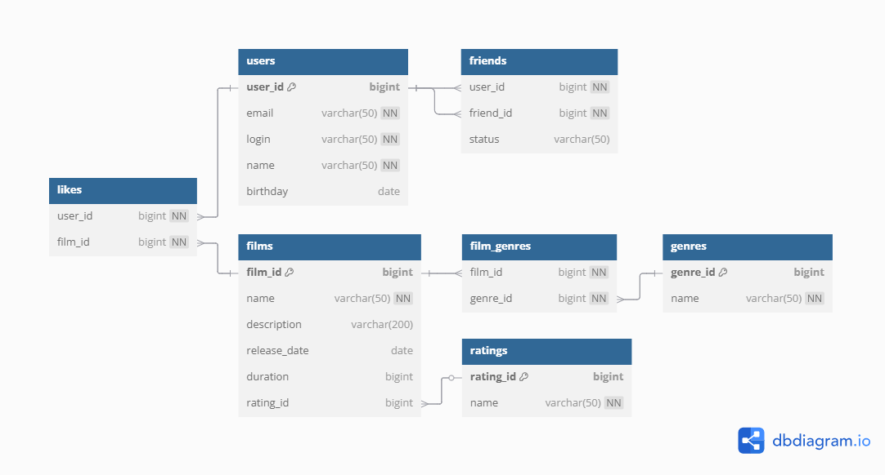

# java-filmorate
Template repository for Filmorate project.

## Schema Visualization



# Database Schema

```sql
-- Users table stores all registered users
CREATE TABLE IF NOT EXISTS users (
    user_id BIGINT GENERATED BY DEFAULT AS IDENTITY (START WITH 1) PRIMARY KEY,
    email VARCHAR(50) NOT NULL UNIQUE,
    login VARCHAR(50) NOT NULL UNIQUE,
    name VARCHAR(50) NOT NULL,
    birthday DATE
);

-- Ratings table contains age rating categories (G, PG, PG-13, etc)
CREATE TABLE IF NOT EXISTS ratings (
    rating_id BIGINT GENERATED BY DEFAULT AS IDENTITY (START WITH 1) PRIMARY KEY,
    name VARCHAR(50) NOT NULL
);

-- Films table stores movie information
CREATE TABLE IF NOT EXISTS films (
    film_id BIGINT GENERATED BY DEFAULT AS IDENTITY (START WITH 1) PRIMARY KEY,
    name VARCHAR(50) NOT NULL,
    description VARCHAR(200),
    release_date DATE,
    duration BIGINT,
    rating_id BIGINT,
    FOREIGN KEY (rating_id) REFERENCES ratings (rating_id)
);

-- Genres table contains movie genres (Comedy, Drama, etc)
CREATE TABLE IF NOT EXISTS genres (
    genre_id BIGINT GENERATED BY DEFAULT AS IDENTITY (START WITH 1) PRIMARY KEY,
    name VARCHAR(50) NOT NULL
);

-- Friends table manages user friendships (many-to-many)
CREATE TABLE IF NOT EXISTS friends (
    user_id BIGINT NOT NULL,
    friend_id BIGINT NOT NULL,
    PRIMARY KEY (user_id, friend_id),
    FOREIGN KEY (user_id) REFERENCES users (user_id) ON DELETE CASCADE,
    FOREIGN KEY (friend_id) REFERENCES users (user_id) ON DELETE CASCADE,
    status VARCHAR(50)
);

-- Likes table tracks which users liked which films
CREATE TABLE IF NOT EXISTS likes (
    user_id BIGINT NOT NULL,
    film_id BIGINT NOT NULL,
    PRIMARY KEY (user_id, film_id),
    FOREIGN KEY (user_id) REFERENCES users (user_id) ON DELETE CASCADE,
    FOREIGN KEY (film_id) REFERENCES films (film_id) ON DELETE CASCADE
);

-- Film_genres junction table for film-genre relationships
CREATE TABLE IF NOT EXISTS film_genres (
    film_id BIGINT NOT NULL,
    genre_id BIGINT NOT NULL,
    PRIMARY KEY (film_id, genre_id),
    FOREIGN KEY (film_id) REFERENCES films (film_id) ON DELETE CASCADE,
    FOREIGN KEY (genre_id) REFERENCES genres (genre_id) ON DELETE CASCADE
);
```

# Initialization Script

```sql
INSERT INTO ratings (RATING_ID, name) VALUES (1,'G');
INSERT INTO ratings (RATING_ID, name) VALUES (2,'PG');
INSERT INTO ratings (RATING_ID, name) VALUES (3,'PG-13');
INSERT INTO ratings (RATING_ID, name) VALUES (4,'R');
INSERT INTO ratings (RATING_ID, name) VALUES (5,'NC-17');
INSERT INTO genres (GENRE_ID,name) VALUES (1,'Комедия');
INSERT INTO genres (GENRE_ID,name) VALUES (2,'Драма');
INSERT INTO genres (GENRE_ID,name) VALUES (3,'Мультфильм');
INSERT INTO genres (GENRE_ID,name) VALUES (4,'Триллер');
INSERT INTO genres (GENRE_ID,name) VALUES (5,'Документальный');
INSERT INTO genres (GENRE_ID,name) VALUES (6,'Боевик');
INSERT INTO genres (GENRE_ID,name) VALUES (7,'123123');
```

